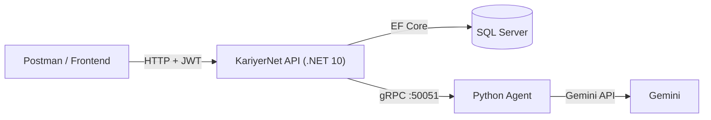

# KariyerNet — AI Destekli Kariyer Platformu

İşverenlerin ilan açıp başvuruları yönettiği, adayların CV yükleyip ilanlara başvurduğu bir kariyer platformu. Python ile yazılmış ayrı bir **AI Agent** (Google Gemini), CV'leri analiz eder, ilanlara uyumluluk skoru üretir ve adaya uygun ilanlar önerir. .NET API ile Agent birbirleriyle **gRPC** üzerinden konuşur.

## Özellikler

**Aday**
- Kayıt ol / giriş yap (JWT)
- CV yükle (PDF veya DOCX)
- İlanları listele, ilan detayı gör
- İlana başvur, kendi başvurularını ve durumlarını gör
- CV'sini AI'a analiz ettir: beceriler, deneyim seviyesi, özet ve geliştirme önerileri
- CV'sine göre kendisine en uygun ilanların sıralı önerisini al

**İşveren**
- İlan oluştur, kendi ilanlarını listele
- İlana gelen başvuruları gör (AI uyumluluk skoru ve açıklamasıyla)
- Başvuruyu kabul / reddet
- Adayın CV'sini indir

**AI Agent**
- CV analizi ve iyileştirme önerileri
- CV – ilan karşılaştırması: 0–100 uyumluluk skoru, işverene üçüncü şahıs, adaya ikinci şahıs dilinde açıklama
- Birden fazla ilan arasından adaya uygun olanları seçip sıralama

## Mimari



API tarafı katmanlı mimari ile yazılmıştır:

| Katman | Sorumluluk |
|---|---|
| `KariyerNet` (API) | Controller'lar, kimlik doğrulama, `Program.cs`, arka plan servisleri |
| `KariyerNet.Application` | İş kuralları (servisler), DTO'lar, validator'lar, arayüzler (`IAgentClient` vb.) |
| `KariyerNet.Domain` | Entity'ler |
| `KariyerNet.Infrastructure` | EF Core, repository'ler, migration'lar, gRPC client (`AgentClient`) |
| `KariyerNet.Agent` | Python gRPC servisi, Gemini entegrasyonu |

**Tasarım kararları**
- **Bağımlılık yönü:** Application katmanı Infrastructure'ı tanımaz. Agent'a `IAgentClient` arayüzü üzerinden erişir, gRPC ayrıntıları Infrastructure'da kalır.
- **gRPC:** C# ile Python arasında ortak bir `.proto` sözleşmesi kullanılır, iki taraf için de istemci/sunucu kodu bu sözleşmeden üretilir.
- **CV doğrudan dosya olarak gönderilir:** PDF, metne çevrilmeden Gemini'ye bayt olarak iletilir. Böylece tablo ve çok sütunlu düzenler bozulmaz.
- **Başvuru anında döner:** AI değerlendirmesi 10–15 saniye sürebildiği için başvuru isteğini bloklamaz. Başvuru kaydedilir, değerlendirme bir kuyruğa (`Channel` + `BackgroundService`) atılır ve skor arka planda doldurulur.

## Teknolojiler

- .NET 10, ASP.NET Core Web API, Entity Framework Core, SQL Server
- JWT (rol bazlı yetkilendirme), BCrypt ile şifre hash'leme
- FluentValidation
- gRPC (`Grpc.Net.Client`, Python tarafında `grpcio`)
- Python, Google Gemini (`google-genai`)
- Postman koleksiyonu

## Proje Yapısı

```
KariyerNet/
├── KariyerNet/                  # API katmanı (Controllers, Program.cs, BackgroundServices)
├── KariyerNet.Application/      # Servisler, DTO'lar, validator'lar, arayüzler
├── KariyerNet.Domain/           # Entity'ler
├── KariyerNet.Infrastructure/   # EF Core, repository'ler, migration'lar, AgentClient, Protos/
├── KariyerNet.Agent/            # Python gRPC servisi (server.py, proto/)
├── postman/                     # Postman koleksiyonu ve environment dosyaları
├── docs/                        # Kod rehberi
└── KariyerNet.slnx
```

## Kurulum

### Gereksinimler

- .NET 10 SDK
- SQL Server (LocalDB veya tam sürüm)
- Python 3.10+ (geliştirmede 3.13 kullanıldı)
- Bir Google Gemini API anahtarı ([aistudio.google.com/apikey](https://aistudio.google.com/apikey))
- `dotnet-ef` aracı: `dotnet tool install --global dotnet-ef`

### 1. Veritabanı

`KariyerNet/appsettings.json` içindeki bağlantı dizesini kendi SQL Server örneğine göre düzenle, sonra migration'ları uygula:

```powershell
cd KariyerNet
dotnet ef database update --project ..\KariyerNet.Infrastructure --startup-project .
```

### 2. JWT anahtarı

JWT imzalama anahtarı repoda tutulmaz. Geliştirme ortamında `user-secrets` ile verilir (en az 32 karakterlik rastgele bir değer kullan):

```powershell
cd KariyerNet
dotnet user-secrets set "Jwt:Key" "<en-az-32-karakterlik-rastgele-bir-deger>"
```

Üretim ortamında bunun yerine `Jwt__Key` ortam değişkeni kullanılır.

### 3. Agent (Python)

```powershell
cd KariyerNet.Agent
python -m venv venv
.\venv\Scripts\activate
pip install grpcio grpcio-tools google-genai python-dotenv
```

`KariyerNet.Agent` klasöründe `.env` dosyası oluştur (bu dosya `.gitignore` ile repo dışında tutulur):

```
GEMINI_API_KEY=senin-gemini-anahtarin
```

Agent'ı başlat:

```powershell
python server.py
```

`Agent gRPC server 50051 portunda çalışıyor` mesajını görmelisin. Bu terminal açık kalmalı.

### 4. API

Yeni bir terminalde:

```powershell
cd KariyerNet
dotnet run
```

API varsayılan olarak `http://localhost:5161` adresinde çalışır. Agent'a bağlantı adresi (`http://localhost:50051`) `AgentClient` içinde tanımlıdır.

> Agent kapalıyken API çalışmaya devam eder. Agent'a bağlı özellikler (CV analizi, ilan önerisi, başvuru skoru) çalışmaz, diğer her şey çalışır.

### Postman

`postman/` klasöründe `KariyerNet API` koleksiyonu ve environment dosyaları bulunur. Önce **Giriş(employer)** ve **Giriş(candidate)** isteklerini çalıştır. Dönen token'lar script ile `employertoken` ve `candidatetoken` değişkenlerine yazılır ve diğer isteklerde otomatik kullanılır. Token'ların ömrü 60 dakikadır.

**Hızlı deneme akışı**
1. `Auth/register` ile bir işveren ve bir aday kaydet (`Role`: `Employer` / `Candidate`)
2. İşveren olarak giriş yap, ilan oluştur
3. Aday olarak giriş yap, CV yükle
4. Aday olarak ilana başvur, birkaç saniye sonra başvurularını listele: `matchScore` ve `aiExplanation` dolmuş olmalı
5. İşveren olarak başvuruları listele, adayın CV'sini indir, başvuruyu kabul/reddet

## API Endpoint'leri

| Method | Yol | Rol | Açıklama |
|---|---|---|---|
| POST | `/api/Auth/register` | Herkes | Kayıt (`FullName`, `Email`, `Password`, `Role`) |
| POST | `/api/Auth/login` | Herkes | Giriş, JWT döner |
| POST | `/api/CandidateProfile` | Aday | CV yükle (`multipart/form-data`, alan adı `cvFile`, PDF/DOCX, en çok 5 MB) |
| GET | `/api/CandidateProfile/me` | Aday | CV bilgilerini görüntüle |
| POST | `/api/CandidateProfile/me/analyze` | Aday | CV'yi AI ile analiz et (beceriler, seviye, özet, öneriler) |
| GET | `/api/JobPostings` | Herkes | İlanları listele |
| GET | `/api/JobPostings/{id}` | Herkes | İlan detayı |
| POST | `/api/JobPostings` | İşveren | İlan oluştur |
| GET | `/api/JobPostings/mine` | İşveren | Kendi ilanlarını listele |
| GET | `/api/JobPostings/recommended` | Aday | CV'ye göre uygun ilan önerileri (skor ve gerekçeyle) |
| POST | `/api/JobApplications` | Aday | İlana başvur (`jobPostingId`) |
| GET | `/api/JobApplications/me` | Aday | Kendi başvurularını listele |
| GET | `/api/JobApplications/posting/{jobPostingId}` | İşveren | İlana gelen başvurular |
| PUT | `/api/JobApplications/{id}/status` | İşveren | Başvuruyu `Accepted` / `Rejected` yap |
| GET | `/api/JobApplications/{id}/cv` | İşveren | Adayın CV dosyasını indir |

**Başvuru kuralları**
- CV yüklememiş aday başvuru yapamaz.
- `Pending` veya `Accepted` bir başvurusu olan aday aynı ilana tekrar başvuramaz (`409`).
- `Rejected` olan aday tekrar başvurabilir. Aynı kayıt `Pending`'e döner ve AI skoru yeniden hesaplanır.
- `matchScore` boşsa AI değerlendirmesi henüz tamamlanmamıştır.

## AI Agent

Sözleşme `KariyerNet.Agent/proto/agent.proto` dosyasında tanımlıdır. Üç RPC vardır:

| RPC | İş |
|---|---|
| `AnalyzeCv` | CV'den beceri, seviye, özet ve öneri çıkarır |
| `MatchCandidateToJob` | CV'yi bir ilanla karşılaştırır, skor ve iki ayrı açıklama üretir |
| `RecommendJobs` | CV'ye göre bir ilan listesinden en uygun olanları seçip sıralar |

**`.proto` dosyası iki yerde tutulur ve birebir aynı olmalıdır:**
- `KariyerNet.Agent/proto/agent.proto` (Python tarafı)
- `KariyerNet.Infrastructure/Protos/agent.proto` (.NET tarafı)

Sözleşmeyi değiştirirsen:

```powershell
# Python tarafı: kodu yeniden üret
cd KariyerNet.Agent
.\venv\Scripts\activate
python -m grpc_tools.protoc -I proto --python_out=. --grpc_python_out=. proto/agent.proto

# .NET tarafı: build sırasında otomatik üretilir
cd ..\KariyerNet.Infrastructure
dotnet clean
dotnet build
```

Kullanılan Gemini modeli `server.py` içindeki `MODEL_NAME` değişkeninde tutulur. Geçici hatalarda (ör. yoğunluk kaynaklı `503`) Agent isteği 3 kez dener.

## Güvenlik

- Şifreler BCrypt ile hash'lenir, hiçbir API cevabında dönmez (cevaplar entity yerine DTO ile verilir).
- JWT anahtarı ve Gemini anahtarı repoda yoktur (`user-secrets` ve `.env`).
- Rol bazlı yetkilendirme: işveren yalnızca kendi ilanlarının başvurularını görebilir, güncelleyebilir ve CV'sini indirebilir.
- CV yükleme: uzantı, boyut ve dosya imzası (magic byte) doğrulanır, dosyalar rastgele (GUID) adla `wwwroot` dışında saklanır. İndirmede yol, `Uploads/Cvs` klasörünün dışına çıkamaz.
- İlan metinleri Agent'a "veri" olarak verilir, içlerindeki talimatlara uyulmaması istenir. Bu prompt injection riskini azaltır ama tam garanti vermez.

## Bilinen Sınırlamalar ve Gelecek Çalışmalar

- Arka plan kuyruğu bellektedir. API, bir değerlendirme sürerken kapanırsa o başvurunun skoru boş kalır. Kalıcı bir kuyruk (veritabanı tablosu veya mesaj kuyruğu) ve bir `AiEvaluationStatus` alanı eklenebilir.
- Reddedilen aday sınırsız tekrar başvurabilir, her başvuru bir Gemini çağrısı demektir. Başvuru sayısına veya süreye bağlı bir sınır konabilir.
- AI skorları kaba tahmindir. Aynı girdi için küçük farklılıklar olabilir, sıralama skor değerinden daha güvenilirdir.
- Gemini ücretsiz katmanında yoğunluk dönemlerinde istekler yavaşlayabilir veya başarısız olabilir.
- İlan önerisi, performans için en yeni 50 ilanla sınırlıdır.
- Frontend yoktur. CORS ve Swagger UI henüz eklenmemiştir.
- Birim ve entegrasyon testleri yoktur.
